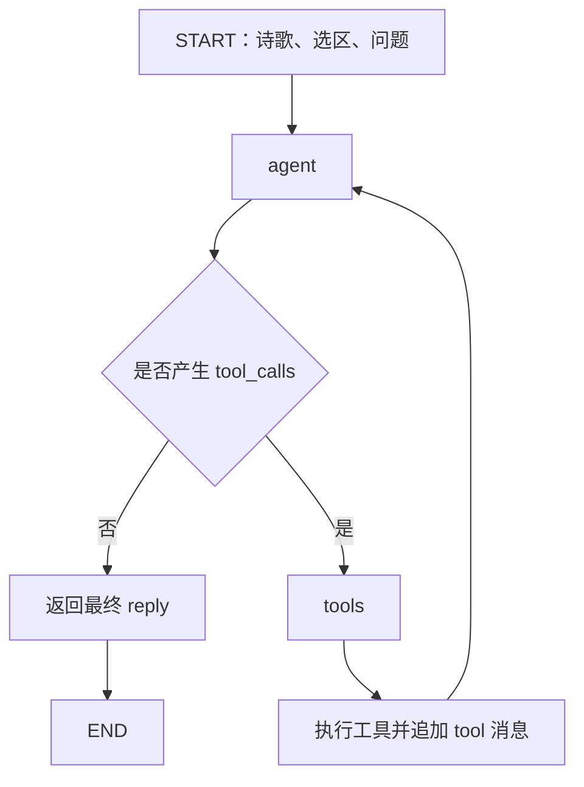

# Poeticus：LangGraph Agent 架构

## 1. 目标与边界

根据当前诗歌、作品信息、用户选区及问题，由 Agent 决定直接回答，还是调用外部工具获取资料。

当前使用 ReAct 式循环，不再采用固定意图分类工作流。用户选区为理解问题提供线索，不强制作为工具查询对象。

首版仅提供 CNKGraph 典故检索工具。跨用户轮次的短期上下文采用 client-carried bounded history：前端携带近期有效的 user / assistant 历史，后端校验后在 Agent 首次执行时插入当前问题之前。

## 2. 执行流程

入口配置在 `langgraph.json`，现在指向 `backend/ai/graph.py:graph`。根目录 `intent_router.py` 仅保留旧导入路径的兼容；工作流已不再进行意图分类。

### agent

首次执行时，使用 `agent_decide` 和 `output_style` Prompt 构造消息。模型结合诗歌内容、作品信息、选区及问题，决定直接回答或调用工具。

再次执行时，沿用消息历史，包括先前的工具调用及其返回结果。

没有工具调用时，节点返回最终 `reply`；存在工具调用时，将其交给 `tools` 节点。

### tools

当前支持 `lookup_allusion`，通过 EvidenceService 查询 CNKGraph 的典故资料。

工具返回结果后，Graph 不会直接结束，而是把结果作为 `tool` 消息追加到消息历史，再交还给 Agent。

工具结果可能为成功、未命中、执行错误或超出预算。检索得到的候选资料不等于已经核实的文献出处。

每次用户请求最多实际执行 8 次工具调用。达到预算后，后续工具请求返回预算不足结果，由 Agent 根据已有信息继续处理。

## 3. Graph State

`RouterState` 定义于 `backend/ai/graph.py`。

| 字段 | 用途 |
|---|---|
| `poem`、`question` | 必需输入：诗歌原文和用户问题 |
| `selection`、`context` | 可选的选区及作品信息 |
| `history` | 当前用户轮次之前、已经完成并通过校验的短期对话历史 |
| `messages` | 当前请求中的 Agent 执行消息历史 |
| `tool_calls` | 当前待执行的工具调用 |
| `tool_results` | 最近一轮工具执行结果 |
| `tool_count` | 已执行的工具次数 |
| `evidences` | 累计获得的候选资料 |
| `reply` | 最终回答 |
| `stream_reply` | 是否采用流式模型调用 |

`history` 与 `messages` 分工不同：`history` 是跨用户轮次传入的短期会话背景；`messages` 是当前一次 Agent 执行中逐步增长的消息记录，包括工具调用和工具结果。服务端 Thread 持久化与长期记忆仍未实现。

## 4. 普通与流式接口

普通聊天和流式聊天共用同一个 Graph：

- `POST /chat` 使用 `graph.invoke()`，完成后返回回答。
- `POST /chat/stream` 使用 `graph.stream()`，同时接收 `custom` 和 `updates` 两类事件。

流式模式下，模型生成的正文片段通过 `custom` token 事件传给 FastAPI；Graph 的 `updates` 事件用于获取节点结果，包括最终 `reply`。

FastAPI 将正文片段包装为 SSE `token` 事件。正常结束时发送 `done`，执行失败时发送 `error`。

对于没有增量 token 的回答，API 会根据最终 `reply` 补发正文；已有完整增量正文时，不应再次发送全文。API 同时检查增量正文与 Graph 最终结果是否一致。

### 已知流式问题

目前模型可能在一次工具调用消息中，同时生成普通文字和 `tool_calls`。这些工具调用前的说明文字可能提前作为 token 发送，并显示在正式回答前。

这是已记录的 Issue #6，尚未完成中间消息与最终回答的彻底分离。不要将当前行为描述为已经解决。

## 5. 失败处理

Graph 和 API 分别处理不同层面的错误：

- 模型 API 请求失败或返回异常结束状态时，中止相应执行。
- 工具参数非法、检索失败等情况，由工具层尽可能转换为结构化工具结果，供 Agent 后续处理。
- 工具调用信息不完整或调用 ID 重复等无法安全继续的情况，作为执行错误处理。
- SSE 已经开始发送后发生异常时，通过 `error` 事件通知前端，而不是尝试改写 HTTP 状态码。

LangSmith 用于追踪 Graph 节点及模型执行过程；Python Logging 记录本地异常。FastAPI 的 SSE 处理错误不一定会直接出现在 LangSmith 的 Graph Trace 中。

## 6. 当前限制和后续工作

- **Conversation 持久化**：模型已经支持 bounded multi-turn history，但刷新 / 切诗恢复当前会话由 Issue #8 负责；未来服务端持久化见 #40。
- **Agent 质量评测**：需要建立针对工具选择、资料利用、多轮指代和回答质量的新评测基线，见 Issue #42。
- **工具与证据能力**：目前仅支持 CNKGraph 典故检索；更完整的工具路由和证据聚合仍待完善，见 Issue #32。
- **流式中间消息**：工具调用前的文字可能被展示，见 Issue #6。
- **重新生成界面**：当前临时草稿框的展示方式待调整，见 Issue #39。

不应把旧版 `classify_intent`、`direct_answer`、`source_lookup` 或 `clarify_user` 描述为当前 Graph 节点。
