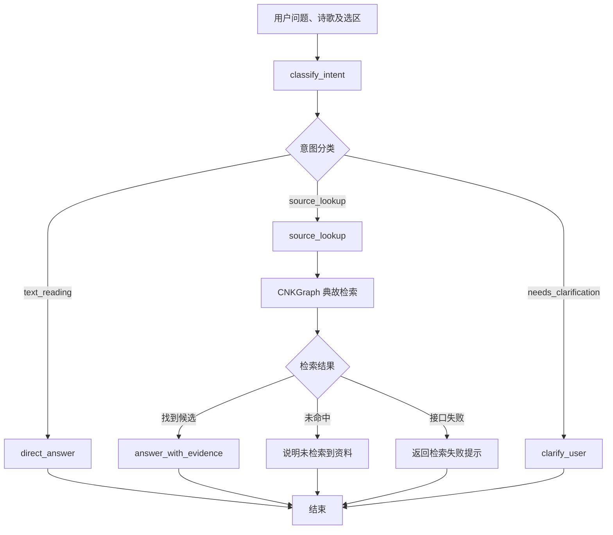

# Poeticus：LangGraph 工作流

## 1. 目标

根据用户的问题和诗歌选区，决定直接进行文学细读、
查询外部文献，还是要求用户进一步说明。

首版采用固定的三分支工作流，不实现通用自主 Agent。

## 2. 执行流程

## 3. Graph State

输入包括 poem、question 和可选的 selection。

工作流执行期间增加 intent、reason、next_step、
evidences、reply、trace_id 等字段。

stream_reply 仅用于指示是否通过流式接口生成回答。
trace_id 用于关联同一次请求的执行日志，不属于用户内容。

## 4. 节点职责

- classify_intent：调用 DeepSeek，输出三种固定意图之一，
  并通过 Pydantic 校验结果。
- direct_answer：结合诗歌原文直接回答文学问题。
- source_lookup：确定查询对象，检索 CNKGraph，
  将候选资料交给证据回答模型。
- clarify_user：缺少必要信息时，请用户明确查询对象。

## 5. 执行追踪

使用同一个 trace_id 关联分类、工具检索和回答节点。

每个节点记录执行状态与耗时；检索另外记录 Provider、
候选数量、是否命中及失败类型。

默认不记录诗歌全文、用户问题全文、API Key 或证据全文。

LangSmith 用于更深入的模型调用追踪，
本地结构化日志用于日常调试和故障定位。

## 6. 失败处理

意图分类返回非法标签时停止工作流并报告错误。

CNKGraph 查询失败时向用户说明本次未取得资料；
查询无结果不代表相关文献不存在。

当前 source_lookup 内部可能返回澄清提示，
但不会再跳转执行 clarify_user 节点。

## 7. 流式输出

direct_answer 可以通过 Graph custom 事件逐步输出 Token。

source_lookup 和 clarify_user 当前在计算完成后，
由 SSE 接口一次性发送最终回答。

流式接口与普通接口复用同一个 Graph。

## 8. 已知限制

- 尚未支持多轮对话状态。
- 当前外部检索仅使用 CNKGraph 典故接口。
- source_lookup 仍以选区优先、正则提取方式确定查询对象。
  当选区与问题明确指定的对象不一致时，可能查错资料。
- 候选证据不等于经过核实的文献出处。
- 缺少跨作品、大规模路由质量评测。

查询对象提取、工具选择和补查归入 #32；
进一步的模型质量评测归入 #14。
