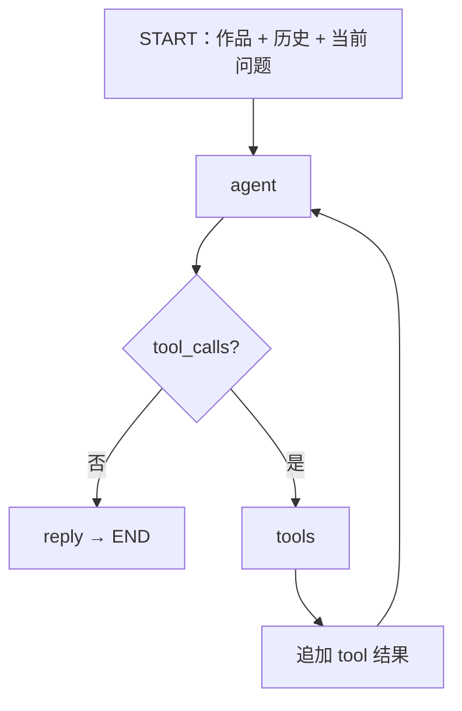

# Poeticus：LangGraph Agent 架构

## 1. 当前模型

Poeticus 的聊天工作流定义在 `backend/ai/graph.py`，`langgraph.json` 直接指向 `backend/ai/graph.py:graph`。

当前使用 ReAct 式循环：模型根据当前作品、作品元数据、用户选区、近期对话和问题，决定直接回答或调用外部工具。系统不再使用固定 Intent Router。

## 2. Agent

首次进入 `agent` 时，系统组合：

1. system prompt；
2. 前端携带、后端已经校验的 bounded history；
3. 当前作品上下文、选区和问题。

之后的 Agent 轮次沿用本次请求的 `messages`，其中包含工具调用与工具返回。

模型、输出 Token 预算和工具调用预算都来自后端统一配置。当前单次用户请求最多执行 **2 次实际工具调用**；达到预算后不再允许新的真实工具执行，并要求模型基于已有上下文与工具结果直接给出最终回答。代码还会拦截模型把内部工具协议误当成正文输出的情况。

## 3. 工具与 Evidence

当前注册两个 Tool，二者都通过 `EvidenceService` 调用 CNKGraph provider，但解决的问题不同：

| Tool | 输入 | 当前用途 | 主要边界 |
| --- | --- | --- | --- |
| `lookup_allusion` | `term` | 查询人物、故事、典故性短语的出处或含义 | 不用于整句全文相似检索，也不负责普通文学赏析 |
| `lookup_reference` | `text` | 查询一句或短句可能对应的前代诗文、成句或化用候选 | 返回的是候选，不等于已经证明来源关系；高度压缩、反用等关系仍可能漏检 |

`lookup_allusion` 最多向下一轮模型返回 3 条 Evidence，`lookup_reference` 最多返回 5 条，后者多保留候选以便比较文本与年代关系。外部文本进入后续模型调用前会做长度限制。

Tool 结果可以是：

- `ok`
- `no_hit`
- `error`
- `budget_exceeded`

Evidence 只提供查证材料。尤其是 `lookup_reference` 的文本命中可能包含当前作品、后代作品或相似但无直接来源关系的文本，Agent 仍需结合作者年代、当前作品和文本关系判断，不能把“检索命中”直接写成“确定化用”。

## 4. Graph State

`RouterState` 的主要字段：

| 字段 | 用途 |
| --- | --- |
| `poem` / `question` | 当前原文和问题 |
| `selection` / `context` | 可选选区与作品元数据 |
| `history` | 此轮之前的短期 user / assistant 历史 |
| `messages` | 当前一次 Agent 执行内部消息 |
| `tool_calls` / `tool_results` | 当前工具请求与最近结果 |
| `tool_count` | 已执行工具数量 |
| `evidences` | 累计候选证据 |
| `reply` | 最终回答 |
| `stream_reply` | 是否使用流式模型调用 |

`history` 与 `messages` 不是同一层：前者跨用户轮次，由客户端携带；后者只服务当前这一次 Graph 执行。

## 5. HTTP 与流式输出

公开聊天入口：

- `POST /api/chat` → `graph.invoke()`
- `POST /api/chat/stream` → `graph.stream()`

开发代理兼容的无 `/api` 路径仍由 FastAPI 路由支持，但项目内部 Python 模块不再保留根目录兼容入口。

流式模式使用 LangGraph `custom` 事件传正文 token，用 `updates` 获取节点结果。FastAPI 转为 SSE：

- `token`
- `done`
- `error`

如果模型在工具调用前先输出说明文字，这部分可能先显示；工具完成后的正式回答以新的 token 段继续输出。API 会校验最终正式回答与 Graph 的 `reply` 一致。

## 6. 会话边界

浏览器可以保存比模型实际看到的更多历史。发送请求时，前端从 `/api/capabilities` 获取后端声明的最大历史轮数，再只发送最近已完成 Turn；后端仍做最终校验。

服务端目前没有长期 Conversation persistence、跨设备同步或可恢复 Run。详情见 [conversation-state.md](conversation-state.md)。
